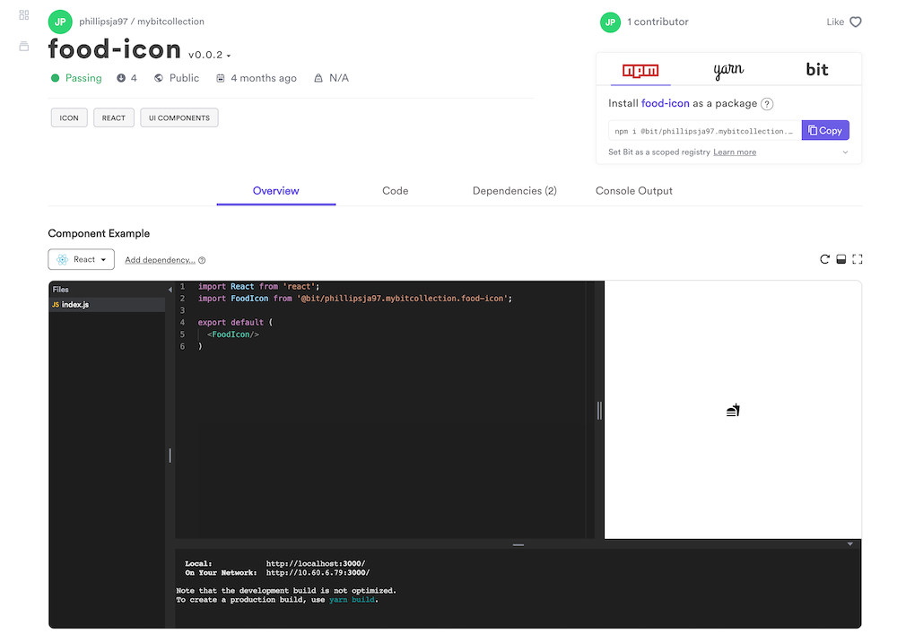
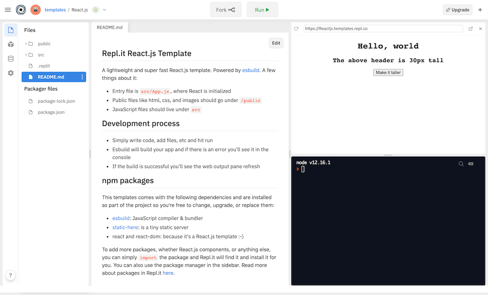
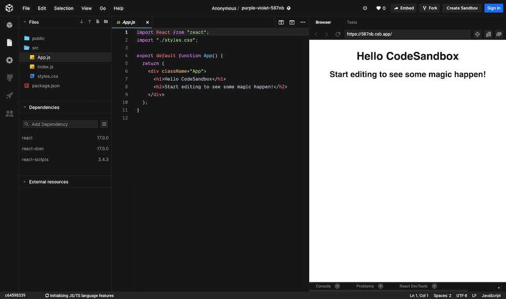
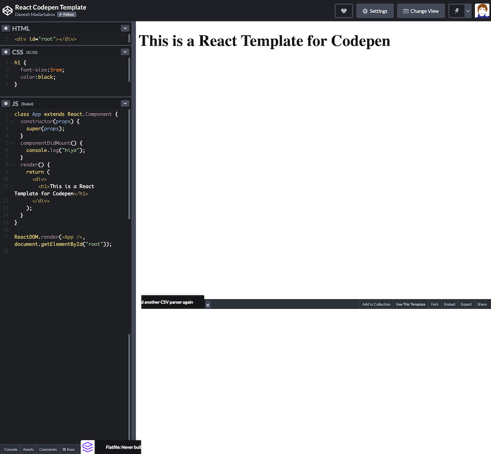
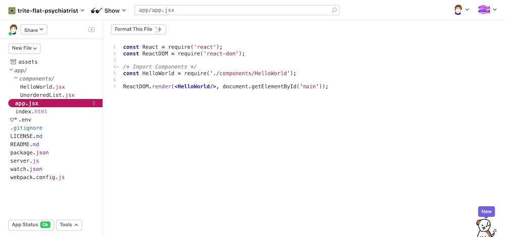

## Bit.dev

[bit.dev](https://bit.dev/phillipsja97/mybitcollection/food-icon)

(signup with github)

## Repl .it

[https://repl.it/](https://repl.it/)

(signup by clicking on the  github icon)

Template: [Repl.it React.js Template](https://repl.it/@templates/Reactjs#README.md)

## Codesandbox

[https://codesandbox.io](https://codesandbox.io/)

Search for [react examples](https://codesandbox.io/search?query=react&page=1&configure%5BhitsPerPage%5D=12)

## Codepen

[https://codepen.io/](https://codepen.io/)

See [react-examples](https://codepen.io/collection/DjOaOj/)

## Glitch

[https://glitch.com/](https://glitch.com/)

Fork a [Template](https://glitch.com/edit/#!/trite-flat-psychiatrist)

See [react-examples](https://codepen.io/collection/DjOaOj/)

