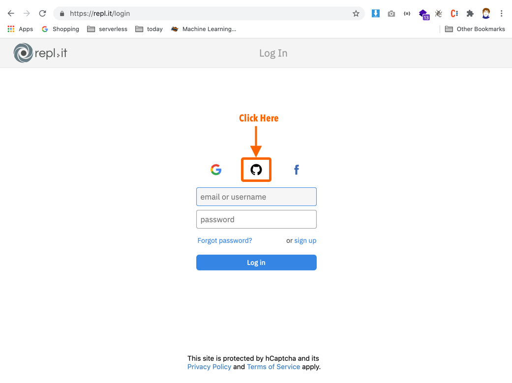
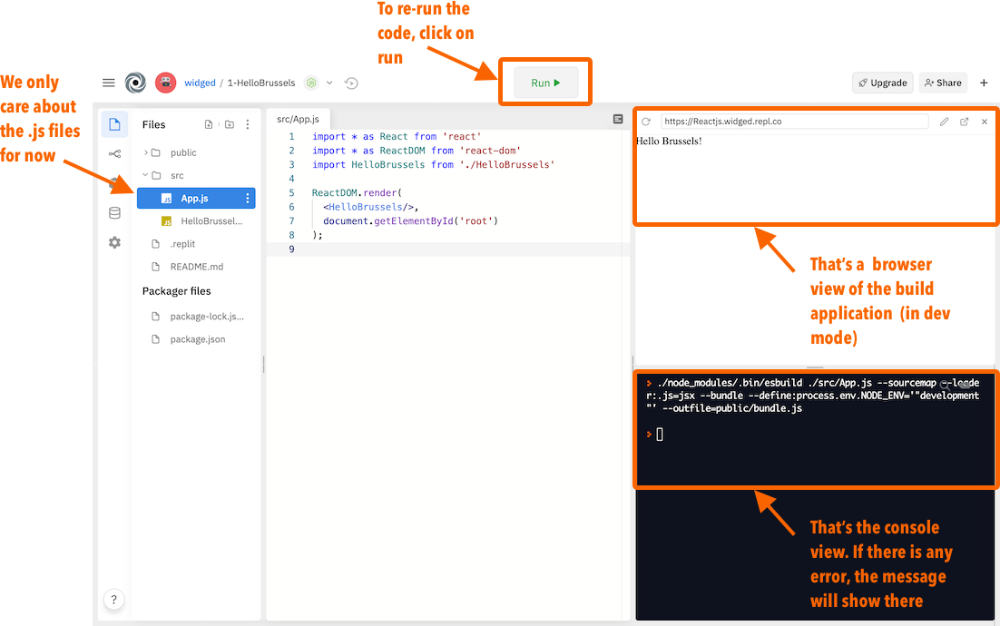

We are going to use `repl.it`

## Login using github

## Navigate to this repo and fork

[https://repl.it/@widged/1-HelloBrussels](https://repl.it/@widged/1-HelloBrussels)

## Adding dependencies

[https://repl.it/@widged/1-HelloBrussels](https://repl.it/@widged/1-HelloBrussels)

